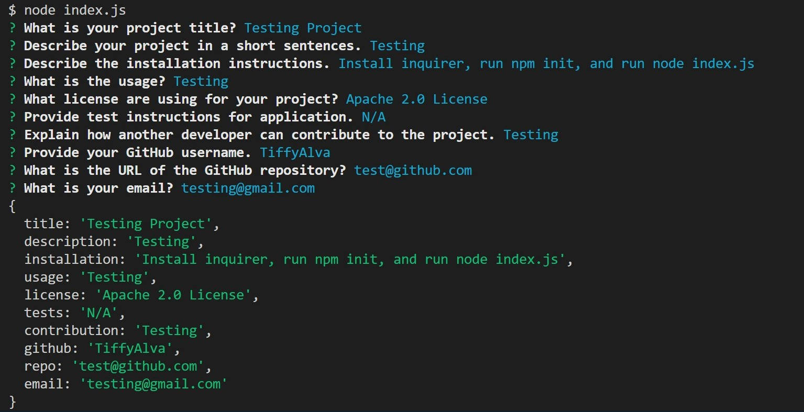

# README-Generator

 "A command-line application that dynamically generates a professional README.md file from a user's input using the <a href= "https://www.npmjs.com/package/inquirer" rel="nofollow">Inquirer package.</a>"

## Description:
N/A

## Table of Contents
  * [User Story](#user-story)
  * [Acceptance criteria](#acceptance-criteria)
  * [Visuals](#visuals)
  * [Installation](#installation)
  * [Usage](#usage) 
  * [License](#license)
  * [Contributing](#contributing)
  * [Tests](#tests)
  * [Contact Informations](#contact) 
  * [Demo Video](#demo-video) 

## User Story 
<pre>AS A developer
I WANT a README generator
SO THAT I can quickly create a professional README for a new project</pre>

## Acceptance Criteria: 
<pre><b>GIVEN</b> a command-line application that accepts user input
<b>WHEN</b> I am prompted for information about my application repository
<b>THEN</b> a high-quality, professional README.md is generated with the title of my project and sections entitled Description, Table of Contents, Installation, Usage, License, Contributing, Tests, and Questions
<b>WHEN</b> I enter my project title
<b>THEN</b> this is displayed as the title of the README
<b>WHEN</b> I enter a description, installation instructions, usage information, contribution guidelines, and test instructions
<b>THEN</b> this information is added to the sections of the README entitled Description, Installation, Usage, Contributing, and Tests
<b>WHEN</b> I choose a license for my application from a list of options
<b>THEN</b> a badge for that license is added near the top of the README and a notice is added to the section of the README entitled License that explains which license the application is covered under
<b>WHEN</b> I enter my GitHub username
<b>THEN</b> this is added to the section of the README entitled Questions, with a link to my GitHub profile
<b>WHEN</b> I enter my email address
<b>THEN</b> this is added to the section of the README entitled Questions, with instructions on how to reach me with additional questions
<b>WHEN</b> I click on the links in the Table of Contents
<b>THEN</b> I am taken to the corresponding section of the README</pre>

## Visuals:
- Terminal:

- VS Code:

## Installation: 
- First, install "<b>inquirer</b>", and use  "<b>npm i inquirer@8.2.4</b>"
- Open your VS Code
- Open Terminal, and use the following command: "<b>node index.js</b>"

## Usage:
- Open command line on VS Code

## License:
- For more information on license types: https://opensource.org/

## Contributing:
- Clone the starter code 

## Tests:
- When questions are all answered, a new README is generated succesfully.

## Contact Informations:
* GitHub Username: <a href="https://github.com/TiffyAlva">TiffyAlva</a>
* Email: <a href="malito:TiffanyAlvarez54@gmail.com">TiffanyAlvarez54@gmail.com

## Demo Video: 
* 

